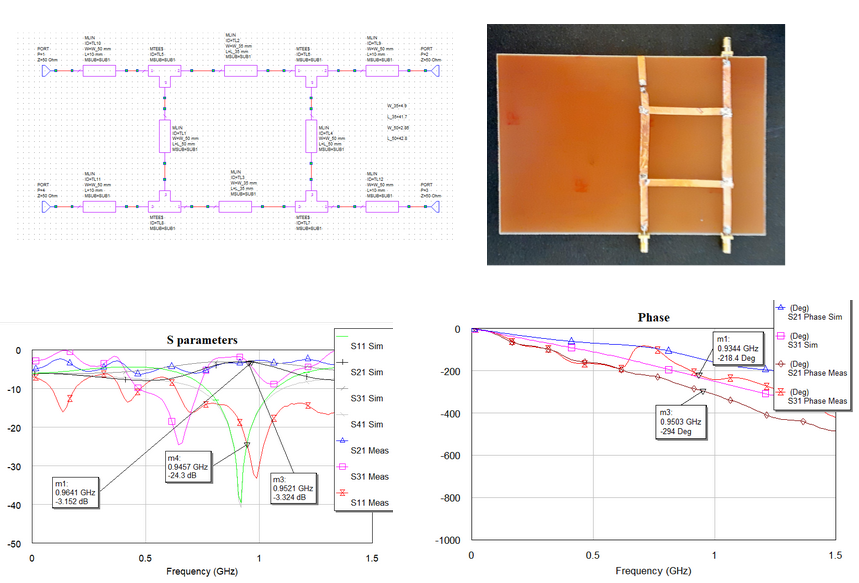
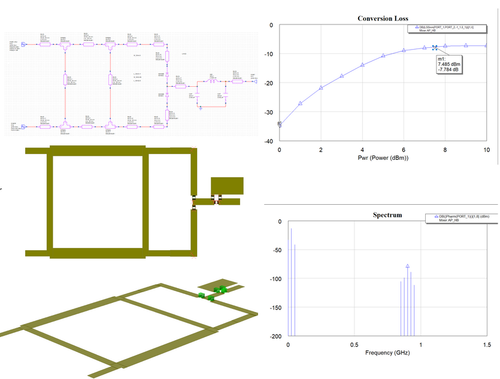
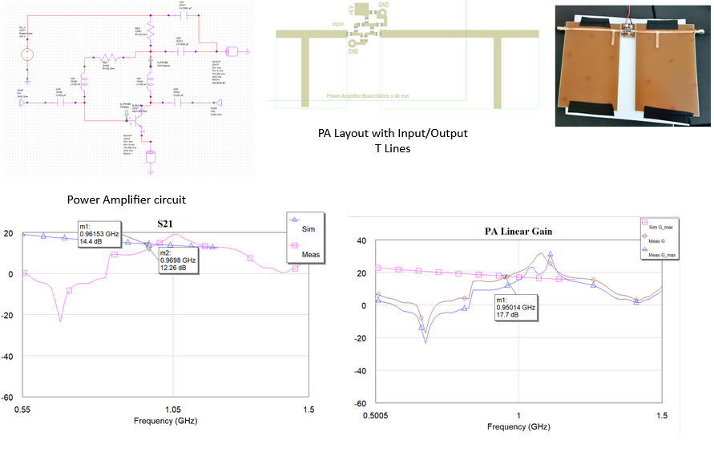
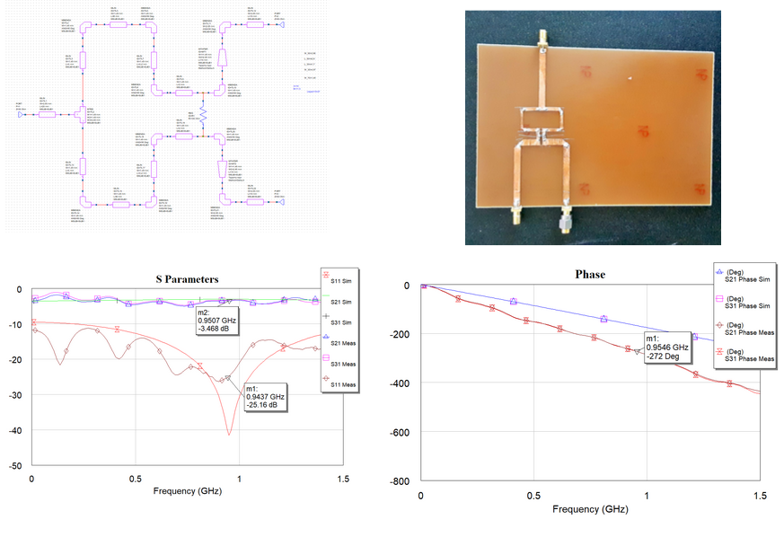
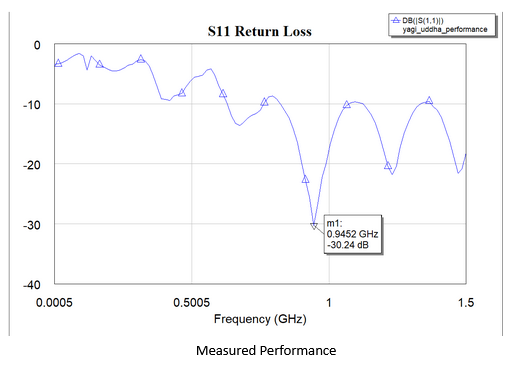

## A 950MHz QAM RF Frontend

A full implementation of a 950MHz QAM RF Frontend designed in AWR, fabricated with FR4 and copper tape, and fully tested. Five components were developed as part of this project:

## Branchline Coupler

## Branchline Mixer

## Power Amplifier

## Power Divider

## Yagi Udhha Antenna
