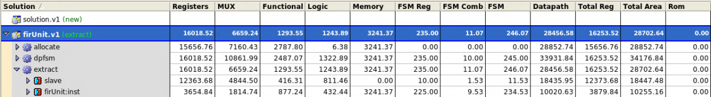
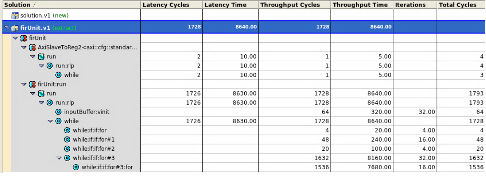

## A \"Silicon Compiler\" and FIR Accelerator

This project was an experiment in EDA, Hardware/Software codesign, High-Level Synthesis (HLS), and SOC design. It proceeded in two phases:
- Design of an automatic build system for place-and-route of arbitrary Verilog or SystemC, enabling the use of ML techniques in the design process
- Extension of Berkley's Chipyard project with a custom FIR accelerator written with Nvidia Matchlib and Catapult HLS, connected through an AXI4 bus, synthesized with the silicon compiler, and cosimulated with the entire system

The system architecture is shown below:

Final area and timing results are shown below:

