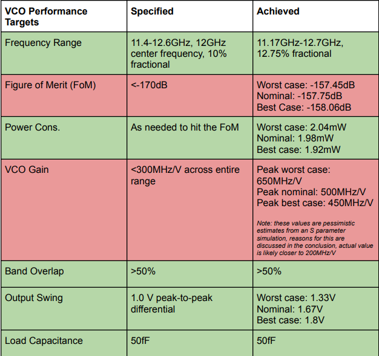
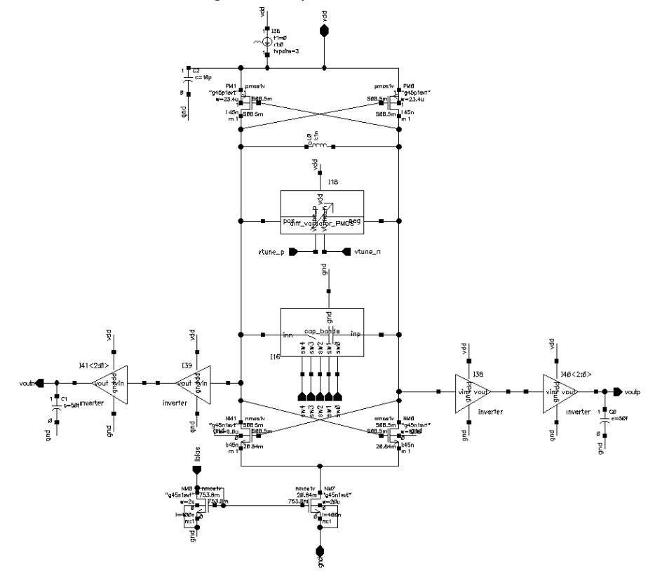
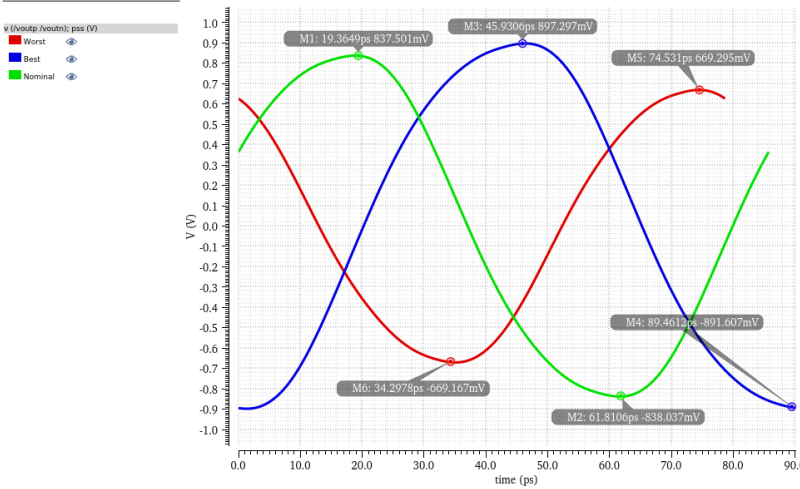
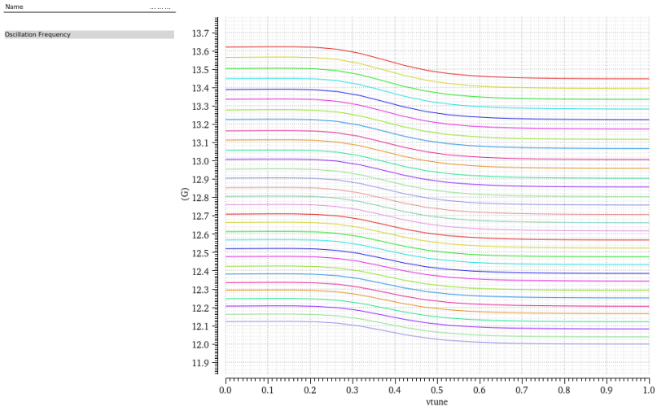

## A 12GHz LC VCO in 45nm CMOS

This project was completed during the Spring Semester of 2023 as part of NCSU's graduate-level RFIC course. The VCO features custom high-Q inductors and over 50% band overlap. Below, you can find the specification table.

## Schematic

## Periodic Steady State Analysis

## Oscillation Frequency
